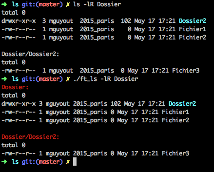

# LS
1er projet de la branche UNIX du [cursus 42](https://www.42.fr).

## Description

Ce projet consiste à recopier la commande système "ls" avec un bon nombre d'options de base notamment l'option -R qui va continuer de lister les fichiers présents dans le répertoire demandé ainsi que ses sous-répertoires.

## Usage

```
$> make
$> ./ft_ls [-lRart]
```

## Exemple imagé


